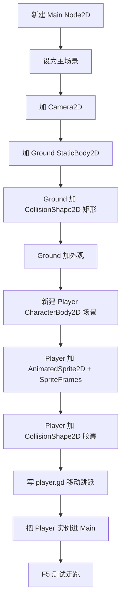

 # Godot 2D 搭建步骤：从空场景到可走跳（firebot）

> 面向：自己手搓代码时对照  
> 工程：`C:\Users\yehai\Documents\firebot`  
> 引擎：Godot **4.7.1**  
> 类型：横版 2D 动作  
> 相关：[[游戏设定：]] · [[装备与动画分层说明]] · [[游戏开发推荐网站]] · [[温柔小管家]] · [[踩坑-my_test相机地面与tscn编码]]

---

## 0. 先记住一张「关系图」

整局最小可玩结构可以想成：

```text
Main (Node2D)                 ← 这一关的「容器 / 导演」
├── Camera2D                  ← 决定玩家看见哪一块屏幕
├── Ground (StaticBody2D)     ← 不会动的地板（物理静态）
│   ├── CollisionShape2D      ← 告诉物理引擎「这块区域是实心」
│   └── FloorVisual (Polygon2D / Sprite2D)  ← 只负责「看起来像地」
└── Player (CharacterBody2D)  ← 会动、受重力、可撞墙的角色
    ├── AnimatedSprite2D      ← 只负责「看起来像火柴人」
    └── CollisionShape2D      ← 角色的「身体碰撞盒」
```

**核心原则（后面每一步都围着它转）：**

| 概念 | 负责什么 | 不负责什么 |
|------|----------|------------|
| `*Body2D`（物理体） | 移动、重力、碰撞 | 画画 |
| `CollisionShape2D` | 碰撞形状 | 外观 |
| `AnimatedSprite2D` / `Polygon2D` | 外观 | 碰撞（默认） |
| 脚本挂在谁身上 | 谁就执行逻辑 | — |

> 外观节点和碰撞节点**分开**，以后换皮肤、调手感都不会缠在一起。

---

## 1. 打开工程前先确认

1. 用 **Godot 4.7.1** 打开 `firebot`  
2. 素材已在：`res://assets/player/sword/`（PNG 帧）  
3. 输入映射建议已有（没有就自己加）：

| Action 名 | 键 | 用途 |
|-----------|----|------|
| `move_left` | A / ← | 左移 |
| `move_right` | D / → | 右移 |
| `jump` | Space / W | 跳 |
| `attack` | J / 鼠标左 | 攻（后面课） |
| `pause` | Esc | 暂停（后面课） |

**原因：** 脚本里写 `Input.is_action_pressed("jump")`，不写死键盘码，以后改键、做手机虚拟键都方便。

路径：`项目 → 项目设置 → 输入映射`（关掉「显示内置动作」才容易看到自己的 action）。

---

## 2. 第一步：建主场景（关卡容器）

### 2.1 新建场景

1. `场景 → 新建场景`  
2. 根节点选 **`Node2D`**，改名为 `Main`  
3. 保存为：`res://scenes/main.tscn`

**为什么根是 Node2D？**

- 这是 **2D 世界**的坐标系原点  
- 关卡里放地板、玩家、相机、以后的旗子/敌人，都挂在它下面  
- 它本身**不做**角色物理；它只是「这一关的文件夹」

### 2.2 设为主场景

`项目 → 项目设置 → 应用 → 运行 → 主场景`  
选 `res://scenes/main.tscn`

**原因：** 按 F5 时引擎要知道从哪启动；没有主场景会直接报错。

---

## 3. 第二步：相机 Camera2D

在 `Main` 下：`添加子节点 → Camera2D`

建议：

- 勾选 **Enabled**（或运行后设为当前相机）  
- 位置先放在关卡中心附近，例如 `(640, 360)`（若窗口是 1280×720）

**为什么要相机？**

- 没有 `Camera2D` 时，游戏用默认视口，角色一跑出屏幕就看不见  
- 以后可把相机做成玩家的子节点，或用脚本让相机跟随玩家  
- **现在先固定相机也能学走跳**；跟机可以第二轮再加

**和谁关联：** 属于 `Main`；看的是 2D 世界，不是 UI。

---

## 4. 第三步：地面（让角色有东西站）

地面 = **物理静态体** + **碰撞形状** + **可选外观**

### 4.1 建物理体

在 `Main` 下添加：`StaticBody2D`，改名 `Ground`

**为什么是 StaticBody2D？**

| 类型 | 适合 |
|------|------|
| `StaticBody2D` | 地板、墙、不会自己动的东西 |
| `CharacterBody2D` | 玩家、自己用代码移动的角色 |
| `RigidBody2D` | 箱子、会被撞飞的物理物体（v1 先不用） |

地板不需要重力把自己拉下去，所以用 **Static**。

### 4.2 碰撞形状（必须有）

在 `Ground` 下添加：`CollisionShape2D`

1. 选中它 → 右侧检查器 → `Shape` → 新建 **`RectangleShape2D`**  
2. 把矩形拉宽（例如 size `1400 × 40`）  
3. 把 `Ground` 整体移到屏幕偏下（例如 position `(640, 650)`）

**原因：**

- `StaticBody2D` **自己没有形状**；没有 `CollisionShape2D` 就等于「隐形且穿模」  
- 角色 `move_and_slide()` 是靠撞到这个形状才 `is_on_floor() == true`

### 4.3 外观（可选但建议有）

在 `Ground` 下再加一个只负责画画的节点，例如：

- `Polygon2D`（画一个扁长方形），或  
- `Sprite2D`（用 `assets` 里的地块图）

**原因：** 碰撞盒在编辑器里是半透明，**玩家看不到**；外观节点让你知道「地在哪」。  
外观和碰撞可以差不多大，但**不必是同一个节点**。

---

## 5. 第四步：玩家（单独做成场景，再放进 Main）

### 5.1 为什么玩家要单独 `player.tscn`？

- 主场景管关卡；玩家管自己  
- 以后换关卡，只要实例化同一个 `player.tscn`  
- 脚本、动画、碰撞都集中在玩家场景里，好改

### 5.2 新建玩家场景

1. 新建场景，根节点选 **`CharacterBody2D`**，改名 `Player`  
2. 保存：`res://scenes/player.tscn`

**为什么是 CharacterBody2D？**

- 专为「用代码控制的角色」设计  
- 提供 `velocity`、`move_and_slide()`、`is_on_floor()`  
- 比自己拿 `RigidBody2D` 硬拧手感简单得多

### 5.3 外观：AnimatedSprite2D

在 `Player` 下添加：`AnimatedSprite2D`

1. 检查器 → `Sprite Frames` → 新建 `SpriteFrames`  
2. 添加动画，例如：

| 动画名 | 素材前缀（你的包） | 是否循环 |
|--------|-------------------|----------|
| `idle` | `sword_Idle_*.png` | 是 |
| `run` | `sword_run_*.png` | 是 |
| `jump` | `sword_jump_*.png` | 否 |
| `attack` | `sword_combo_*.png` | 否（后面课） |

素材目录：`res://assets/player/sword/`

3. 缩放建议先试 `0.35`（原图 512×512 偏大）  
4. 贴图过滤建议用 **Nearest**（火柴人细线更稳，少闪）

**原因：**  
`AnimatedSprite2D` 只换图；真正「站在地上」靠下面的碰撞 + 脚本物理。

### 5.4 碰撞：CollisionShape2D

在 `Player` 下添加：`CollisionShape2D`

1. `Shape` → `CapsuleShape2D`（火柴人竖长身体很合适）  
2. 调 `radius` / `height`，让胶囊大致罩住身子（可比画略小，手感更好）  
3. 可略向下偏移，让脚底对齐地面

**原因：**

- 没有碰撞盒 → 穿地、无法跳跃判定  
- 盒太大 → 蹭墙卡顿；太小 → 脚陷地  
- **永远用碰撞盒调手感，不要用图片边界当碰撞**

### 5.5 挂脚本

选中 `Player` → 附加脚本 → `res://scripts/player.gd`

脚本里最小逻辑（你自己写，这里只列「该有什么」）：

1. `_physics_process` 里加重力：`velocity += get_gravity() * delta`  
2. 读取 `move_left` / `move_right` 改 `velocity.x`  
3. `jump` 且 `is_on_floor()` 时给 `velocity.y` 负值  
4. 最后调用 `move_and_slide()`  
5. 用 `AnimatedSprite2D.play("idle"/"run"/"jump")` 切换动画  

**为什么逻辑挂在 CharacterBody2D 上？**  
因为它才有 `velocity` / `move_and_slide`；挂在 `AnimatedSprite2D` 上也能写，但职责乱。

### 5.6 把玩家放进主场景

1. 打开 `main.tscn`  
2. 把 `player.tscn` **拖进**场景树（实例化）  
3. 把玩家放在地面上方（例如 `(640, 520)`）

**关联：**

```text
Main 实例化 Player
  → 运行时玩家成为 Main 的子节点
  → 玩家的碰撞会和 Ground 的碰撞在同一物理世界里结算
```

---

## 6. 节点之间「谁连着谁」（总表）

| 从 | 到 | 关系 | 为什么 |
|----|----|------|--------|
| `Main` | `Ground` / `Player` / `Camera2D` | 父子（场景树） | 关卡统一加载/卸载 |
| `Ground` | `CollisionShape2D` | 父子 | 静态体必须有形状 |
| `Ground` | 外观节点 | 父子 | 只显示，不替代碰撞 |
| `Player` | `CollisionShape2D` | 父子 | 角色必须有身体盒 |
| `Player` | `AnimatedSprite2D` | 父子 | 跟着角色坐标画图 |
| `Player` 脚本 | `InputMap` actions | 逻辑读取 | 解耦按键 |
| `Player` 物理 | `Ground` 物理 | 引擎自动碰撞 | 同层 `collision_layer/mask` 要能碰到 |
| `Camera2D` | 2D 世界 | 观察 | 决定屏幕显示区域 |

碰撞层（以后再细调也行）：

- 默认大家都在 layer 1、mask 1 → 能互撞  
- 以后：玩家 / 敌人 / 地形 分开层，避免误撞

---

## 7. 建议操作顺序（按这个勾）



每一步都能单独验收：

1. 只有地面 + 相机 → F5 能看到地  
2. 玩家放上但脚本空 → 人会掉下去（说明重力/碰撞在工作）  
3. 写完移动 → 能左右走  
4. 写完跳跃 → `is_on_floor` 为真时能跳起  

---

## 8. 常见坑（手搓时对照）

| 现象 | 常见原因 | 怎么查 |
|------|----------|--------|
| 一按 F5 报没有主场景 | 没设 Main | 项目设置 → 主场景 |
| 角色直直掉穿地 | 地面或玩家缺 `CollisionShape2D` / shape 为空 | 看两个碰撞节点 |
| 不能跳 | 没站在地上或没写 `is_on_floor()` | 调试打印 `is_on_floor()` |
| 能走但没动画 | `SpriteFrames` 空或名字和代码不一致 | 动画名 `idle`/`run` 要对上 |
| 人太大/太小 | `AnimatedSprite2D.scale` | 先 0.3～0.4 |
| 跳到最高点头闪 | Linear 过滤 + 细线亚像素 | 用 Nearest；跳跃帧别死循环重播 |
| 编辑器里看不到人、运行才有 | 只在代码里临时 `SpriteFrames.new()` | 做成 `.tres` 赋给节点更直观 |

---

## 9. 和 firebot 素材怎么接

1. 原始大包：`res://assets/player/rgs_stickman/`（已 `.gdignore` 可不导入）  
2. 常用帧：`res://assets/player/sword/`  
   - `sword_Idle_*` / `sword_run_*` / `sword_jump_*` / `sword_combo_*`  
3. 还有 `Sword sprites`、`Pistol sprites` 在大包里，以后要换武器再拷出来即可  

授权：RGS 包为 **CC0**，可商用。

---

## 10. 下一阶段（写完走跳再做）

按依赖顺序，不要跳：

1. **攻击动画**（`attack` + 输入 `attack`）  
2. **攻击判定**（`Area2D` 作 Hitbox，短时间监测）  
3. **敌人**（另一个 `CharacterBody2D` 或简化 `Area2D`）  
4. **终点 / 死亡重开**（`Area2D` 触发）  
5. **相机跟随**（相机作玩家子节点，或脚本追 `global_position`）  
6. **触屏按钮**（`CanvasLayer` + 虚拟键，读同一套 Input actions）

每一项都是「新节点 + 一点脚本」，仍然遵守：**物理体 / 碰撞 / 外观分离**。

---

## 11. 官方文档（卡住时查）

- [第一个 2D 游戏](https://docs.godotengine.org/zh-cn/4.x/getting_started/first_2d_game/index.html)  
- [CharacterBody2D](https://docs.godotengine.org/zh-cn/4.x/classes/class_characterbody2d.html)  
- [使用 CharacterBody2D](https://docs.godotengine.org/zh-cn/4.x/tutorials/physics/using_character_body_2d.html)  
- [AnimatedSprite2D](https://docs.godotengine.org/zh-cn/4.x/classes/class_animatedsprite2d.html)  

---

*师傅手记：你要手搓代码时，把这篇当「施工顺序」；实现细节以你自己写的脚本为准。改玩法先改 [[游戏设定：]]，再改节点。*
