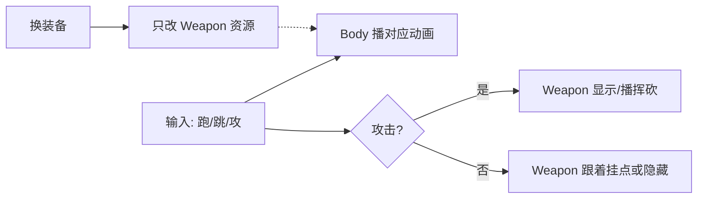

# 装备与动画分层说明（为什么要分层 + 怎么做）

> 工程：`C:\Users\yehai\Documents\firebot`  
> 相关：[[Godot2D搭建步骤-从空场景到可走跳]] · [[游戏设定：]] · [[游戏开发推荐网站]]

---

## 1. 为什么要分层？（核心）

### 1.1 不分层会怎样

若每把武器都做成「整个人重新画一套动画」：

```text
动画总数 ≈ 武器种类 × 动作种类
例：3 把武器 ×（idle/run/jump/attack/hit/death…）= 很快上百套
```

问题：

| 问题 | 说明 |
|------|------|
| 量爆炸 | 加一把枪就要重做跑、跳、站… |
| 改一处动全身 | 跑步手感改了，所有武器套都要重导出 |
| 包体变大 | PNG 帧成倍增加 |
| 难做装备系统 | 「换装」变成「换整个人」 |

你现在的 RGS 包（Fighter / Sword / Pistol 各一整套）就是 **整身烘焙**：上手快，但 **不适合当长期装备方案**。

### 1.2 分层是什么意思

把角色拆成可以独立替换的层：

```text
Player (CharacterBody2D)
├── Body（AnimatedSprite2D）     ← 只播身体：站/跑/跳/攻击姿势
└── Weapon（Sprite2D 或 AnimatedSprite2D）← 刀/枪，换图或换短动画
```

换武器 ≈ 换 `Weapon` 的贴图（或一小段挥砍帧），**身体跑跳可以共用**。



### 1.3 分层解决什么

| 目标 | 分层怎么帮你 |
|------|----------------|
| 多武器 | 身体 1 套 + 每把武器少量资源 |
| 以后护甲/帽子 | 再加 `Hat` / `Outfit` 层即可 |
| 特效 | 刀光挂在 Weapon 上，不重画整身 |
| 和 Godot 配合 | 节点树天然就是「层」 |

### 1.4 分层也有代价（要诚实）

| 代价 | 说明 |
|------|------|
| 要对齐 | 武器要挂在「手」附近，翻转、跳跃时位置要跟着调 |
| 攻击更讲究 | 挥砍要和手臂大致同步（可用挂点、或攻击时切专用帧） |
| 现成烘焙包难直接拆 | Sword 序列里刀已经画进身体图里，**没法一键扣出来** |
| 自制分层素材 | 往往要用 Blender Grease Pencil / 手绘分层重做，或找「身体+武器分离」的素材 |

所以：**分层是架构正确方向；素材要重新按分层方式准备，不是把现有 sword 整图「设置一下」就变分层。**

---

## 2. 三种路线对比（firebot 怎么选）

| 路线 | 做法 | 动画量 | 今天能否开工 | 推荐阶段 |
|------|------|--------|--------------|----------|
| **A. 整身烘焙** | 继续用 `sword_*` 整套 | 高 | ✅ 立刻 | 只做 1 把武器的垂直切片 |
| **B. Godot 分层（占位）** | 用 **Fighter（空手）** 当 Body + Weapon 挂点放刀图 | 中 | ✅ 立刻 | **先学结构** |
| **C. Blender 自制分层** | Grease Pencil 画「身体层 + 武器层」再导出 | 低（长期） | ⚠️ 要先学软件 | 有脸/多装备的长期管线 |

**师傅建议的组合：**

1. **先 B**：在 Godot 里把节点分层建好（今天就能）  
2. **并行开一个「Blender 选修」**：学 Grease Pencil，目标是以后产出真正的分层素材  
3. **v1 可玩关卡**不要被 Blender 卡住——可用 Fighter+占位武器或暂时仍用 sword 整套出第一关  

---

## 3. Godot 里分层怎么挂（先解决结构）

### 3.1 推荐节点树

```text
Player (CharacterBody2D)
├── Body (AnimatedSprite2D)          # fighter_Idle / run / jump …
├── WeaponAnchor (Marker2D)          # 挂点：大约在手的位置
│   └── Weapon (Sprite2D)            # 刀/枪贴图；flip 时跟 Player 一起翻
└── CollisionShape2D
```

**为什么多一个 `WeaponAnchor`？**

- 手在 idle / run / jump 里位置会变  
- 挂点可以按动画微调 `position`（甚至每帧用脚本对一下）  
- 以后换大剑/手枪，只换 Weapon，不拆 Body  

### 3.2 和翻转的关系

玩家 `flip_h` 时：

- Body 要翻  
- WeaponAnchor 的 **x 取反**（或整棵 Player 用 `scale.x = ±1` 统一翻）  

统一用 `Player.scale.x = ±1` 往往比只 flip 精灵更省事（子节点一起翻）。

### 3.3 素材从哪来（现阶段）

| 层 | 现阶段可用 |
|----|------------|
| Body | 从 RGS 包拷 `Fighter sprites` → 如 `res://assets/player/body/` |
| Weapon | 暂时用简单几何 / 自己画一把小刀 PNG；或以后 Blender 导出「仅武器」 |
| 不要做的 | 指望从 `sword_run_*.png` 里自动抠出刀——不现实 |

大包路径（本机）：

`assets/player/rgs_stickman/Stick Figure Character Sprites 2D/Stick Figure Character Sprites 2D/`

- `Fighter sprites` → 身体  
- `Sword sprites` / `Pistol sprites` → 整身烘焙参考，**不是**现成分层武器  

---

## 4. 为什么要学 Blender？（以及学哪一块）

作者 RGS 用的是 **Blender Grease Pencil（2D）**，不是角色 3D 建模。

你要学的是：

| 学 | 不学（v1） |
|----|------------|
| Grease Pencil 画画 / 层 | 复杂 3D 建模、绑骨演戏级流程 |
| 时间轴做 2D 帧 | Geometry Nodes 大工程 |
| 导出 PNG 序列（身体、武器可分开渲染） | 一上来做完整绑定武器物理 |

**分层素材在 Blender 里的理想产出：**

```text
导出/
  body_idle_0001.png …
  body_run_0001.png …
  weapon_sword.png          # 或 weapon_slash_0001.png …
```

Godot 里 Body 播 body_*，Weapon 用 weapon_*。

---

## 5. 今日学习顺序（可执行）

### 今天目标（务实）

**不要：** 今天就做出商业级分层火柴人全套动画。  
**要：**

1. 读懂本文「为什么分层」  
2. Godot 里建好 `Body + WeaponAnchor + Weapon` 空结构  
3. Blender：确认能打开、新建 Grease Pencil、画一个圆头+身体（保存 `.blend`）  

### Day 1 — Godot 分层结构（1～2 小时）

1. 新建 `player.tscn`：`CharacterBody2D`  
2. 子节点按 §3.1 搭好  
3. Body 先用 Fighter 的 idle/run（从大包拷到 `assets/player/body/`）  
4. Weapon 先用任意图（甚至 ColorRect 临时）挂在右手大致位置  
5. 跑起来时武器跟着人动 —— **这就是分层成功的第一课**  

### Day 1 — Blender 入门（1～2 小时，选修同步）

1. 打开 Blender（版本建议 4.x 近期稳定版）  
2. 删除默认立方体 → 添加 **Grease Pencil → Stroke**（或空 GP 对象）  
3. 进入 **Draw** 模式，画：圆头 + 粗身体 + 细四肢（你喜欢的那类）  
4. 在 GP 里建两个层：`Body` / `Weapon`（先画在 Body 上即可）  
5. 存盘：`Documents/firebot/art/hero_gp.blend`（建议新建 `art/` 文件夹，不进 `res://` 也能；若放工程内注意别误当游戏资源乱导入）  

官方入口：

- [Blender 手册 - Grease Pencil](https://docs.blender.org/manual/en/latest/grease_pencil/index.html)  
- [Godot - AnimatedSprite2D](https://docs.godotengine.org/zh-cn/4.x/classes/class_animatedsprite2d.html)  

---

## 6. 里程碑（避免又学飞）

| 阶段 | 完成标准 | 是否必须 Blender |
|------|----------|------------------|
| M0 结构 | Godot 里 Body/Weapon 分层节点跑跳 | 否 |
| M1 可玩 | 一关走跳攻 + 1 敌（武器可用占位或 sword 整套） | 否 |
| M2 真分层素材 | Grease Pencil 导出 body + sword 分离 PNG | 是 |
| M3 多武器 | 换 Weapon 资源即可换枪/刀 | 是（或外部绘制） |

**纪律：** M1 没完成前，Blender 每天限时（例如 1 小时），防止「只学软件不做游戏」。

---

## 7. 一句话结论

- **为什么分层：** 避免「武器 × 动作」动画爆炸，让装备系统可扩展。  
- **先分层什么：** 先分层 **Godot 节点与职责**；再分层 **素材生产**。  
- **Blender 学什么：** Grease Pencil 2D 分层绘制与导出，不是 3D 建模。  
- **今天：** 结构 + Blender 能画；明天再谈导出流水线。  

---

*师傅手记：分层是方向；素材要用分层方式重做。现有 sword 整图当「临时皮肤」可以，别当成最终装备架构。*
